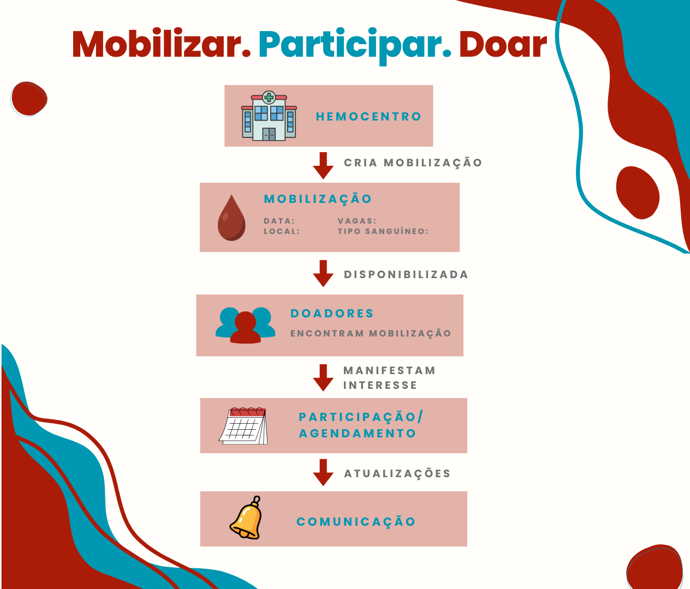
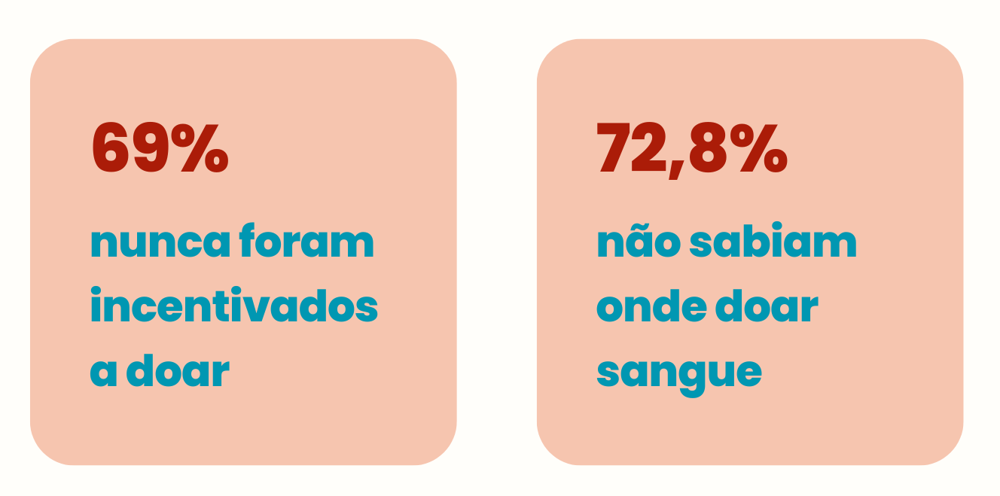

# Nibble — 4Life

> **4Life** é uma plataforma voltada à mobilização e participação em doações de sangue, conectando hemocentros e doadores para facilitar a divulgação de mobilizações, a manifestação de interesse, o agendamento quando necessário e a comunicação com os participantes.

---

## Sobre a Nibble

A **Nibble** é a startup responsável pelo desenvolvimento do **4Life**, um projeto desenvolvido no contexto da disciplina de **Sistemas Distribuídos**.

O projeto parte de um problema social relacionado à dificuldade de transformar o interesse em doar sangue em uma participação efetiva. A proposta é utilizar a tecnologia para aproximar hemocentros e potenciais doadores, facilitando a organização de mobilizações, o acesso a informações confiáveis e a comunicação ao longo desse processo.

---

## Problema e motivação

A doação de sangue é essencial para a manutenção dos serviços de saúde, mas sua continuidade depende da participação voluntária da população. Apesar disso, diferentes estudos apontam barreiras que dificultam a transformação da intenção de doar em uma doação efetiva.

Entre essas barreiras estão a **falta de informação, mitos e tabus, medo do procedimento e dificuldades práticas**, como falta de tempo, pouca flexibilidade dos horários e deslocamento até os serviços de hemoterapia. Estudos também apontam campanhas, estratégias de divulgação e maior facilidade de acesso como fatores que podem contribuir para a captação e fidelização de doadores. [4](#4)

A falta de conhecimento também pode afastar potenciais doadores. Em um estudo com adolescentes, **69% afirmaram nunca ter sido incentivados a doar e 72,8% não sabiam onde ficava um banco de sangue**, além da presença de dúvidas, mitos e tabus relacionados ao processo. [3](#3)

A decisão de doar também é influenciada pela forma como as pessoas compreendem o processo e pela comunicação e experiência associadas à doação, não dependendo exclusivamente da disposição individual. [1](#1)

Uma revisão sobre a realidade brasileira reforça a existência de barreiras relacionadas à **informação, medo, horários, logística, mitos culturais e desconfiança**, enquanto destaca campanhas educativas, facilidade de acesso, experiências positivas e redes sociais como possíveis facilitadores. [2](#2)

Diante desse cenário, o **4Life** propõe atuar em uma etapa anterior e complementar ao processo clínico: **facilitar a conexão entre hemocentros e pessoas dispostas a doar, tornando as mobilizações mais acessíveis e a comunicação mais organizada**.

> **O desafio:** existe interesse em doar, mas ainda há barreiras para transformar esse interesse em participação efetiva.

---

## Impacto social esperado

O 4Life busca contribuir para a mobilização de doadores por meio de:

* 🩸 **Facilitação da doação:** tornar mais simples encontrar oportunidades compatíveis com a rotina do doador.
* 📢 **Mobilização organizada:** aproximar hemocentros e potenciais doadores.
* 📚 **Informação confiável:** reduzir dúvidas e combater mitos relacionados à doação.
* 🔔 **Comunicação:** manter participantes informados sobre mudanças e cancelamentos.
* 🤝 **Maior engajamento:** facilitar a manifestação de interesse e a participação em mobilizações.

O impacto poderá ser acompanhado por indicadores como **número de mobilizações, participantes interessados, usuários alcançados e adesões às mobilizações**.

> **O 4Life não realiza o processo clínico da doação. Seu papel é facilitar a mobilização, a organização e a comunicação entre quem precisa mobilizar doadores e quem deseja participar.**

---

## Esboço da solução

O **4Life** será uma plataforma que conecta **hemocentros e doadores** por meio de mobilizações de doação de sangue.

### 🏥 Para os hemocentros

Funcionários autorizados poderão utilizar a plataforma para criar e administrar mobilizações, informando dados como:

* data e horário;
* hemocentro responsável;
* quantidade de vagas;
* tipo sanguíneo prioritário, quando aplicável;
* período da mobilização;
* demais informações relevantes para os participantes.

As mobilizações poderão ser **simples**, destinadas à captação geral de doadores, ou **específicas**, direcionadas a uma necessidade concreta de doação.

### 🩸 Para os doadores

Os usuários poderão:

* encontrar mobilizações disponíveis;
* consultar suas informações;
* identificar oportunidades compatíveis com sua disponibilidade;
* manifestar interesse em participar;
* fornecer os dados necessários para o processo de participação;
* realizar ou viabilizar o agendamento quando o hemocentro exigir;
* acompanhar alterações relacionadas à mobilização.

### 🔔 Comunicação

Após manifestar interesse em uma mobilização, o doador poderá receber notificações sobre acontecimentos relevantes, como:

* alteração de data ou horário;
* alteração de informações da mobilização;
* cancelamento;
* outras comunicações relacionadas à sua participação.

O **Telegram** será utilizado como um dos canais de interação e comunicação da plataforma.

### 🤖 Assistente inteligente

O 4Life também contará com um **chatbot baseado em LLM**, capaz de auxiliar os usuários com dúvidas relacionadas à doação de sangue e ao funcionamento da plataforma.

O assistente utilizará uma **base de conhecimento própria**, permitindo respostas fundamentadas em informações selecionadas pelo projeto. Além disso, poderá consultar informações do próprio sistema para auxiliar o usuário na busca por mobilizações e outras informações disponíveis na plataforma.

---

## Como o 4Life funciona

---

## Principais conceitos da plataforma

### Mobilizações

São o principal mecanismo de conexão entre hemocentros e doadores.

Uma mobilização poderá ser:

* **Simples:** voltada à captação geral de doadores.
* **Específica:** voltada a uma necessidade concreta de doação.

Cada mobilização poderá possuir informações próprias sobre período, local, disponibilidade de vagas e demais condições para participação.

### Hemocentros

O sistema também disponibilizará informações sobre os hemocentros, permitindo que os usuários consultem dados relevantes antes de participar de uma mobilização, como:

* endereço;
* dias e horários de coleta;
* documentos necessários;
* procedimentos específicos;
* necessidade de agendamento;
* outras orientações importantes.

### Participação

Os doadores poderão manifestar interesse nas mobilizações encontradas e, quando necessário, fornecer os dados mínimos para que o processo de agendamento seja realizado junto ao hemocentro responsável.

### Informações e assistente

Conteúdos educativos e orientativos estarão disponíveis para auxiliar os usuários com dúvidas sobre doação de sangue. O chatbot utilizará esses conteúdos como base para responder perguntas e poderá também consultar informações disponíveis na própria plataforma.

---

## Escopo da proposta

O **4Life** atua como uma plataforma de **mobilização, participação e comunicação** em torno da doação de sangue.

O sistema **não pretende substituir os sistemas clínicos dos hemocentros** nem gerenciar:

* estoque de sangue;
* bolsas coletadas;
* demandas hospitalares;
* transporte de sangue;
* avaliação clínica dos doadores;
* decisões médicas relacionadas à doação.

Seu objetivo é atuar de forma complementar, aproximando **hemocentros e doadores** e facilitando as etapas de mobilização e comunicação que antecedem e acompanham a doação.

---

## Repositório

O projeto **4Life**, desenvolvido pela startup **Nibble** no contexto da disciplina de **Sistemas Distribuídos**, possui seu código-fonte e demais artefatos de desenvolvimento disponibilizados neste repositório público.

### Equipe

O projeto é desenvolvido por uma equipe composta por quatro integrantes:

| Integrante                  | GitHub                                             |
| --------------------------- | -------------------------------------------------- |
| L. Kennedy Gervásio Turola  | [@Kenny-0h](https://github.com/Kenny-0h)           |
| Thaís Giovanna Lopes        | [@thaisgiolopes](https://github.com/thaisgiolopes) |
| Tobias Maugus Bueno Cougo   | [@TobiasMaugus](https://github.com/TobiasMaugus)   |
| João Gabriel Salomão Baldim | [@Goblinjg](https://github.com/Goblinjg)           |

---

## Referências

**[1]** PEREIRA, J. R. et al. *Doar ou não doar, eis a questão: uma análise dos fatores críticos da doação de sangue*. Ciência & Saúde Coletiva, v. 21, n. 8, p. 2475–2484, 2016. DOI: `10.1590/1413-81232015218.24062015`.

**[2]** PASCHOALETTI, M. E.; MARCHELLI, L. P. *Barreiras e facilitadores para a doação de sangue no Brasil: uma revisão de literatura*. Universidade Nove de Julho (UNINOVE), 2025.

**[3]** NOGUEIRA, G. D. et al. *Conhecimento de Adolescentes Sobre a Doação de Sangue*. Saúde Coletiva, v. 14, n. 91, p. 13532–13547, 2024. DOI: `10.36489/saudecoletiva.2024v14i91p13532-13547`.

**[4]** MESQUITA, N. F. et al. *Dificuldades e estratégias relacionadas com a doação de sangue em um serviço de hemoterapia*. Revista Rene, v. 22, e70830, 2021. DOI: `10.15253/2175-6783.20212270830`.

---

## Status do projeto

💡 **Em concepção**

O projeto **4Life** encontra-se atualmente em fase de concepção, com foco na definição do problema, da proposta de solução, do escopo e das principais funcionalidades da plataforma. A implementação do sistema será realizada nas próximas etapas do projeto.
